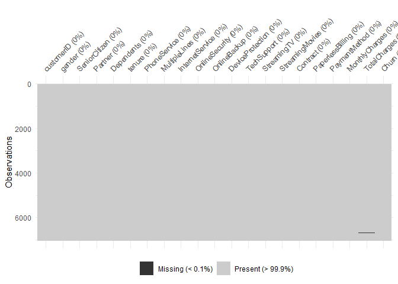
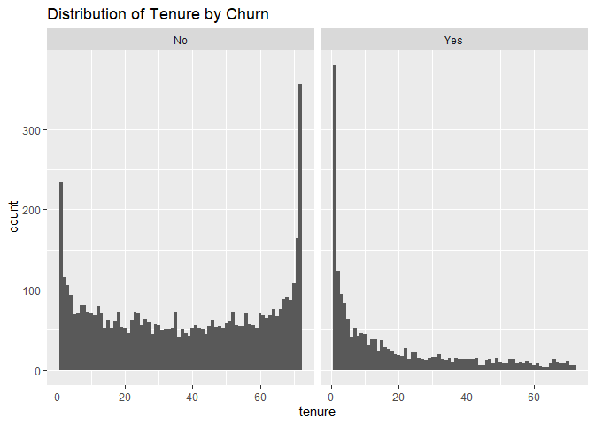
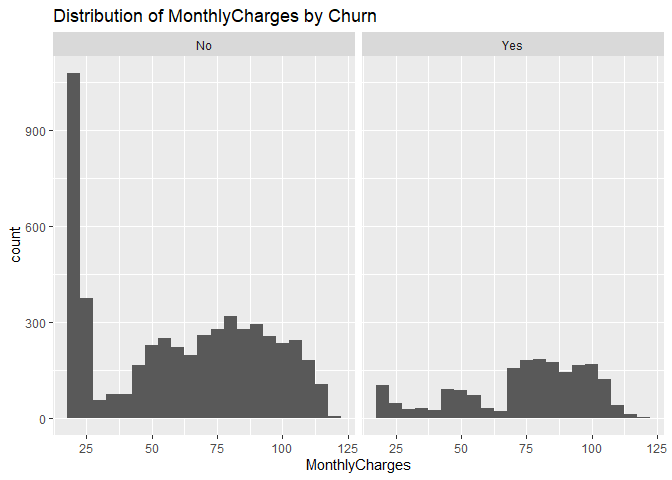
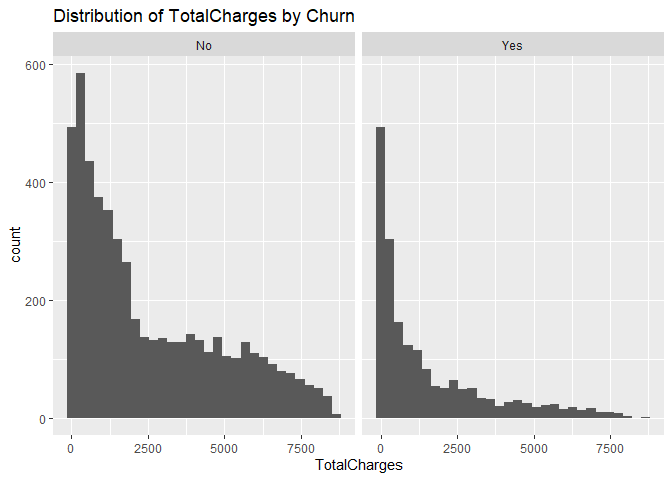
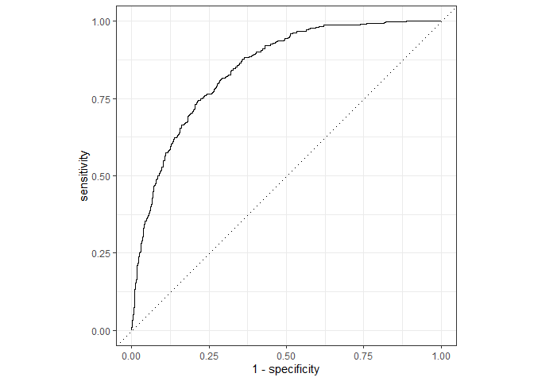
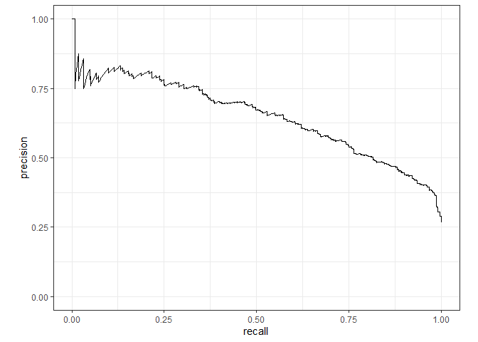
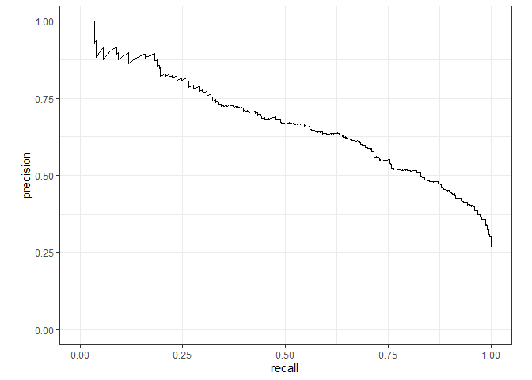
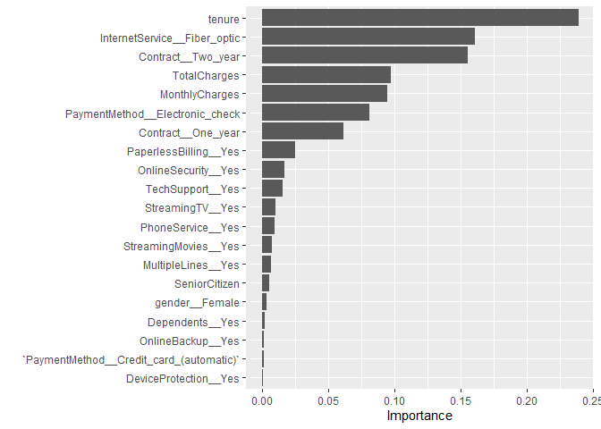

Tidymodels Test
================
John Rollman
3/31/2022

-   [Packages](#packages)
-   [Data Import and Modeling](#data-import-and-modeling)
-   [EDA](#eda)
    -   [Frequency Table for Target](#frequency-table-for-target)
    -   [Frequency Tables for
        Predictors](#frequency-tables-for-predictors)
    -   [Check for Missingness](#check-for-missingness)
    -   [Summary Statistics for
        TotalCharges](#summary-statistics-for-totalcharges)
    -   [Show NAs](#show-nas)
    -   [Summary Statistics for Numeric Variables without
        Nulls](#summary-statistics-for-numeric-variables-without-nulls)
    -   [Data Modeling and
        Binarization](#data-modeling-and-binarization)
    -   [Correlation between Variables](#correlation-between-variables)
    -   [Histogram of Continuous
        Variables](#histogram-of-continuous-variables)
-   [Preprocessing](#preprocessing)
    -   [Split the data into Training and
        Test](#split-the-data-into-training-and-test)
-   [Model Construction](#model-construction)
    -   [Logistic Regression](#logistic-regression)
        -   [Evaluating Model](#evaluating-model)
    -   [XGBoost Model](#xgboost-model)
        -   [Evaluating Model](#evaluating-model-1)
    -   [Comparing AUC and ROC of both
        models](#comparing-auc-and-roc-of-both-models)
    -   [Final Model Construction](#final-model-construction)
-   [Presented Results](#presented-results)
-   [Conclusion](#conclusion)

# Packages

``` r
library(tidyverse)
library(corrplot)
library(knitr)
library(stringr)
library(RColorBrewer)
library(tidymodels)
library(readxl)
library(visdat)
library(naniar)
library(janitor)
library(correlationfunnel)
library(Hmisc)
library(xgboost)
library(vip)
```

# Data Import and Modeling

``` r
raw_dat <- read.csv("C:\\Users\\jcrol\\Desktop\\Statistics\\Learning\\Data\\WA_Fn-UseC_-Telco-Customer-Churn.csv")

kable(head(raw_dat))
```

| customerID | gender | SeniorCitizen | Partner | Dependents | tenure | PhoneService | MultipleLines    | InternetService | OnlineSecurity | OnlineBackup | DeviceProtection | TechSupport | StreamingTV | StreamingMovies | Contract       | PaperlessBilling | PaymentMethod             | MonthlyCharges | TotalCharges | Churn |
|:-----------|:-------|--------------:|:--------|:-----------|-------:|:-------------|:-----------------|:----------------|:---------------|:-------------|:-----------------|:------------|:------------|:----------------|:---------------|:-----------------|:--------------------------|---------------:|-------------:|:------|
| 7590-VHVEG | Female |             0 | Yes     | No         |      1 | No           | No phone service | DSL             | No             | Yes          | No               | No          | No          | No              | Month-to-month | Yes              | Electronic check          |          29.85 |        29.85 | No    |
| 5575-GNVDE | Male   |             0 | No      | No         |     34 | Yes          | No               | DSL             | Yes            | No           | Yes              | No          | No          | No              | One year       | No               | Mailed check              |          56.95 |      1889.50 | No    |
| 3668-QPYBK | Male   |             0 | No      | No         |      2 | Yes          | No               | DSL             | Yes            | Yes          | No               | No          | No          | No              | Month-to-month | Yes              | Mailed check              |          53.85 |       108.15 | Yes   |
| 7795-CFOCW | Male   |             0 | No      | No         |     45 | No           | No phone service | DSL             | Yes            | No           | Yes              | Yes         | No          | No              | One year       | No               | Bank transfer (automatic) |          42.30 |      1840.75 | No    |
| 9237-HQITU | Female |             0 | No      | No         |      2 | Yes          | No               | Fiber optic     | No             | No           | No               | No          | No          | No              | Month-to-month | Yes              | Electronic check          |          70.70 |       151.65 | Yes   |
| 9305-CDSKC | Female |             0 | No      | No         |      8 | Yes          | Yes              | Fiber optic     | No             | No           | Yes              | No          | Yes         | Yes             | Month-to-month | Yes              | Electronic check          |          99.65 |       820.50 | Yes   |

# EDA

### Frequency Table for Target

``` r
tabyl(raw_dat, Churn)
```

    ##  Churn    n   percent
    ##     No 5174 0.7346301
    ##    Yes 1869 0.2653699

Here we can see we have unbalanced outcomes of interest. We could
possibly over-sample the Churn=‘Yes’ population and under sample the
Churn=No. For now the NIR is 73%

### Frequency Tables for Predictors

``` r
freq_dat <- raw_dat %>% select_if(is.character) %>% select(-customerID,-Churn)


for( i in 1:ncol(freq_dat)){
  a =  tabyl(freq_dat,colnames(freq_dat[i])) %>% adorn_pct_formatting(digits = 0, affix_sign = TRUE)
  print(kable(a))
}
```

    ## 
    ## 
    ## |gender |    n|percent |
    ## |:------|----:|:-------|
    ## |Female | 3488|50%     |
    ## |Male   | 3555|50%     |
    ## 
    ## 
    ## |Partner |    n|percent |
    ## |:-------|----:|:-------|
    ## |No      | 3641|52%     |
    ## |Yes     | 3402|48%     |
    ## 
    ## 
    ## |Dependents |    n|percent |
    ## |:----------|----:|:-------|
    ## |No         | 4933|70%     |
    ## |Yes        | 2110|30%     |
    ## 
    ## 
    ## |PhoneService |    n|percent |
    ## |:------------|----:|:-------|
    ## |No           |  682|10%     |
    ## |Yes          | 6361|90%     |
    ## 
    ## 
    ## |MultipleLines    |    n|percent |
    ## |:----------------|----:|:-------|
    ## |No               | 3390|48%     |
    ## |No phone service |  682|10%     |
    ## |Yes              | 2971|42%     |
    ## 
    ## 
    ## |InternetService |    n|percent |
    ## |:---------------|----:|:-------|
    ## |DSL             | 2421|34%     |
    ## |Fiber optic     | 3096|44%     |
    ## |No              | 1526|22%     |
    ## 
    ## 
    ## |OnlineSecurity      |    n|percent |
    ## |:-------------------|----:|:-------|
    ## |No                  | 3498|50%     |
    ## |No internet service | 1526|22%     |
    ## |Yes                 | 2019|29%     |
    ## 
    ## 
    ## |OnlineBackup        |    n|percent |
    ## |:-------------------|----:|:-------|
    ## |No                  | 3088|44%     |
    ## |No internet service | 1526|22%     |
    ## |Yes                 | 2429|34%     |
    ## 
    ## 
    ## |DeviceProtection    |    n|percent |
    ## |:-------------------|----:|:-------|
    ## |No                  | 3095|44%     |
    ## |No internet service | 1526|22%     |
    ## |Yes                 | 2422|34%     |
    ## 
    ## 
    ## |TechSupport         |    n|percent |
    ## |:-------------------|----:|:-------|
    ## |No                  | 3473|49%     |
    ## |No internet service | 1526|22%     |
    ## |Yes                 | 2044|29%     |
    ## 
    ## 
    ## |StreamingTV         |    n|percent |
    ## |:-------------------|----:|:-------|
    ## |No                  | 2810|40%     |
    ## |No internet service | 1526|22%     |
    ## |Yes                 | 2707|38%     |
    ## 
    ## 
    ## |StreamingMovies     |    n|percent |
    ## |:-------------------|----:|:-------|
    ## |No                  | 2785|40%     |
    ## |No internet service | 1526|22%     |
    ## |Yes                 | 2732|39%     |
    ## 
    ## 
    ## |Contract       |    n|percent |
    ## |:--------------|----:|:-------|
    ## |Month-to-month | 3875|55%     |
    ## |One year       | 1473|21%     |
    ## |Two year       | 1695|24%     |
    ## 
    ## 
    ## |PaperlessBilling |    n|percent |
    ## |:----------------|----:|:-------|
    ## |No               | 2872|41%     |
    ## |Yes              | 4171|59%     |
    ## 
    ## 
    ## |PaymentMethod             |    n|percent |
    ## |:-------------------------|----:|:-------|
    ## |Bank transfer (automatic) | 1544|22%     |
    ## |Credit card (automatic)   | 1522|22%     |
    ## |Electronic check          | 2365|34%     |
    ## |Mailed check              | 1612|23%     |

### Check for Missingness

``` r
vis_miss(raw_dat)
```

<!-- -->
There seems to be a very small amount of missing values in the
TotalCharges variable.

### Summary Statistics for TotalCharges

``` r
summary(raw_dat$TotalCharges)
```

    ##    Min. 1st Qu.  Median    Mean 3rd Qu.    Max.    NA's 
    ##    18.8   401.4  1397.5  2283.3  3794.7  8684.8      11

There are 11 missing TotalCharges. We can remove these rows or impute
the values using averages. If they are from the majority class, Churn =
No, then we can probably just exclude them.

### Show NAs

``` r
null_rows <- raw_dat %>% filter(is.na(TotalCharges) | is.na(MonthlyCharges))

null_rows
```

    ##    customerID gender SeniorCitizen Partner Dependents tenure PhoneService
    ## 1  4472-LVYGI Female             0     Yes        Yes      0           No
    ## 2  3115-CZMZD   Male             0      No        Yes      0          Yes
    ## 3  5709-LVOEQ Female             0     Yes        Yes      0          Yes
    ## 4  4367-NUYAO   Male             0     Yes        Yes      0          Yes
    ## 5  1371-DWPAZ Female             0     Yes        Yes      0           No
    ## 6  7644-OMVMY   Male             0     Yes        Yes      0          Yes
    ## 7  3213-VVOLG   Male             0     Yes        Yes      0          Yes
    ## 8  2520-SGTTA Female             0     Yes        Yes      0          Yes
    ## 9  2923-ARZLG   Male             0     Yes        Yes      0          Yes
    ## 10 4075-WKNIU Female             0     Yes        Yes      0          Yes
    ## 11 2775-SEFEE   Male             0      No        Yes      0          Yes
    ##       MultipleLines InternetService      OnlineSecurity        OnlineBackup
    ## 1  No phone service             DSL                 Yes                  No
    ## 2                No              No No internet service No internet service
    ## 3                No             DSL                 Yes                 Yes
    ## 4               Yes              No No internet service No internet service
    ## 5  No phone service             DSL                 Yes                 Yes
    ## 6                No              No No internet service No internet service
    ## 7               Yes              No No internet service No internet service
    ## 8                No              No No internet service No internet service
    ## 9                No              No No internet service No internet service
    ## 10              Yes             DSL                  No                 Yes
    ## 11              Yes             DSL                 Yes                 Yes
    ##       DeviceProtection         TechSupport         StreamingTV
    ## 1                  Yes                 Yes                 Yes
    ## 2  No internet service No internet service No internet service
    ## 3                  Yes                  No                 Yes
    ## 4  No internet service No internet service No internet service
    ## 5                  Yes                 Yes                 Yes
    ## 6  No internet service No internet service No internet service
    ## 7  No internet service No internet service No internet service
    ## 8  No internet service No internet service No internet service
    ## 9  No internet service No internet service No internet service
    ## 10                 Yes                 Yes                 Yes
    ## 11                  No                 Yes                  No
    ##        StreamingMovies Contract PaperlessBilling             PaymentMethod
    ## 1                   No Two year              Yes Bank transfer (automatic)
    ## 2  No internet service Two year               No              Mailed check
    ## 3                  Yes Two year               No              Mailed check
    ## 4  No internet service Two year               No              Mailed check
    ## 5                   No Two year               No   Credit card (automatic)
    ## 6  No internet service Two year               No              Mailed check
    ## 7  No internet service Two year               No              Mailed check
    ## 8  No internet service Two year               No              Mailed check
    ## 9  No internet service One year              Yes              Mailed check
    ## 10                  No Two year               No              Mailed check
    ## 11                  No Two year              Yes Bank transfer (automatic)
    ##    MonthlyCharges TotalCharges Churn
    ## 1           52.55           NA    No
    ## 2           20.25           NA    No
    ## 3           80.85           NA    No
    ## 4           25.75           NA    No
    ## 5           56.05           NA    No
    ## 6           19.85           NA    No
    ## 7           25.35           NA    No
    ## 8           20.00           NA    No
    ## 9           19.70           NA    No
    ## 10          73.35           NA    No
    ## 11          61.90           NA    No

These values are all Churn=No and can probably be excluded if we want to
use the TotalCharges variables.

### Summary Statistics for Numeric Variables without Nulls

``` r
dat2 <- raw_dat %>% na.omit()

kable(do.call(cbind, lapply(select(dat2,tenure, MonthlyCharges, TotalCharges), summary)), caption = "Summary Statistics for Numeric Variables", digits = 1, format = 'html')
```

<table>
<caption>
Summary Statistics for Numeric Variables
</caption>
<thead>
<tr>
<th style="text-align:left;">
</th>
<th style="text-align:right;">
tenure
</th>
<th style="text-align:right;">
MonthlyCharges
</th>
<th style="text-align:right;">
TotalCharges
</th>
</tr>
</thead>
<tbody>
<tr>
<td style="text-align:left;">
Min.
</td>
<td style="text-align:right;">
1.0
</td>
<td style="text-align:right;">
18.2
</td>
<td style="text-align:right;">
18.8
</td>
</tr>
<tr>
<td style="text-align:left;">
1st Qu.
</td>
<td style="text-align:right;">
9.0
</td>
<td style="text-align:right;">
35.6
</td>
<td style="text-align:right;">
401.4
</td>
</tr>
<tr>
<td style="text-align:left;">
Median
</td>
<td style="text-align:right;">
29.0
</td>
<td style="text-align:right;">
70.3
</td>
<td style="text-align:right;">
1397.5
</td>
</tr>
<tr>
<td style="text-align:left;">
Mean
</td>
<td style="text-align:right;">
32.4
</td>
<td style="text-align:right;">
64.8
</td>
<td style="text-align:right;">
2283.3
</td>
</tr>
<tr>
<td style="text-align:left;">
3rd Qu.
</td>
<td style="text-align:right;">
55.0
</td>
<td style="text-align:right;">
89.9
</td>
<td style="text-align:right;">
3794.7
</td>
</tr>
<tr>
<td style="text-align:left;">
Max.
</td>
<td style="text-align:right;">
72.0
</td>
<td style="text-align:right;">
118.8
</td>
<td style="text-align:right;">
8684.8
</td>
</tr>
</tbody>
</table>

### Data Modeling and Binarization

``` r
dat3 <- dat2 %>% select(-customerID) %>% select_if(is.character) %>% binarize() %>% select(!ends_with('__No')&!ends_with('No_internet_service') & !ends_with('No_phone_service')) %>% select(!c('gender__Male','Contract__Month-to-month','PaymentMethod__Mailed_check'))  %>% cbind(select(dat2,SeniorCitizen, tenure, MonthlyCharges, TotalCharges)) 
head(dat3)
```

    ##   gender__Female Partner__Yes Dependents__Yes PhoneService__Yes
    ## 1              1            1               0                 0
    ## 2              0            0               0                 1
    ## 3              0            0               0                 1
    ## 4              0            0               0                 0
    ## 5              1            0               0                 1
    ## 6              1            0               0                 1
    ##   MultipleLines__Yes InternetService__DSL InternetService__Fiber_optic
    ## 1                  0                    1                            0
    ## 2                  0                    1                            0
    ## 3                  0                    1                            0
    ## 4                  0                    1                            0
    ## 5                  0                    0                            1
    ## 6                  1                    0                            1
    ##   OnlineSecurity__Yes OnlineBackup__Yes DeviceProtection__Yes TechSupport__Yes
    ## 1                   0                 1                     0                0
    ## 2                   1                 0                     1                0
    ## 3                   1                 1                     0                0
    ## 4                   1                 0                     1                1
    ## 5                   0                 0                     0                0
    ## 6                   0                 0                     1                0
    ##   StreamingTV__Yes StreamingMovies__Yes Contract__One_year Contract__Two_year
    ## 1                0                    0                  0                  0
    ## 2                0                    0                  1                  0
    ## 3                0                    0                  0                  0
    ## 4                0                    0                  1                  0
    ## 5                0                    0                  0                  0
    ## 6                1                    1                  0                  0
    ##   PaperlessBilling__Yes PaymentMethod__Bank_transfer_(automatic)
    ## 1                     1                                        0
    ## 2                     0                                        0
    ## 3                     1                                        0
    ## 4                     0                                        1
    ## 5                     1                                        0
    ## 6                     1                                        0
    ##   PaymentMethod__Credit_card_(automatic) PaymentMethod__Electronic_check
    ## 1                                      0                               1
    ## 2                                      0                               0
    ## 3                                      0                               0
    ## 4                                      0                               0
    ## 5                                      0                               1
    ## 6                                      0                               1
    ##   Churn__Yes SeniorCitizen tenure MonthlyCharges TotalCharges
    ## 1          0             0      1          29.85        29.85
    ## 2          0             0     34          56.95      1889.50
    ## 3          1             0      2          53.85       108.15
    ## 4          0             0     45          42.30      1840.75
    ## 5          1             0      2          70.70       151.65
    ## 6          1             0      8          99.65       820.50

### Correlation between Variables

``` r
dat3 %>% correlate(target = Churn__Yes)  %>%
    plot_correlation_funnel(interactive = FALSE)
```

<!-- -->
Initially it looks like Tenure and the type of internet service have the
most correlation with churning. This is backed by evaluating
TotalCharges and MonthlyCharges, it looks like those who have already
stayed a long time (large total charges) are likely to not churn and
those with high monthly charges churn early. Thus the wndow of
opportunity for reducing churn is early on in the customer’s service
lifespan.

### Histogram of Continuous Variables

``` r
Churn_labs <- c('No','Yes')
names(Churn_labs) <- c('0','1')

ggplot(dat3,aes(tenure)) + 
  geom_histogram(binwidth = 1) +
  facet_grid(cols = vars(Churn__Yes), labeller = labeller(Churn__Yes = Churn_labs )) +
  ggtitle("Distribution of Tenure by Churn")
```

<!-- -->

``` r
ggplot(dat3,aes(MonthlyCharges)) + 
  geom_histogram(binwidth = 5) +
  facet_grid(cols = vars(Churn__Yes), labeller = labeller(Churn__Yes = Churn_labs )) +
  ggtitle("Distribution of MonthlyCharges by Churn")
```

<!-- -->

``` r
ggplot(dat3,aes(TotalCharges)) + 
  geom_histogram() +
  facet_grid(cols = vars(Churn__Yes), labeller = labeller(Churn__Yes = Churn_labs )) +
  ggtitle("Distribution of TotalCharges by Churn")
```

<!-- --> We
can roughly see that within the first 5 years and monthly charges
greater than about $70 result in more churn.

# Preprocessing

### Split the data into Training and Test

``` r
set.seed(1102)

dat3 <- dat3 %>% mutate(Churn__Yes = as.factor(Churn__Yes))

dat3$Churn__Yes <- relevel(dat3$Churn__Yes, ref = '1')
levels(dat3$Churn__Yes)
```

    ## [1] "1" "0"

``` r
dat_split <- initial_split(dat3,prop = .8)

dat_train <- training(dat_split)
dat_test <- testing(dat_split)

dat_cv <- vfold_cv(dat_train, v=10)
```

# Model Construction

### Logistic Regression

##### Using Traditional Method

``` r
log_t <- glm(Churn__Yes ~ ., data = dat_train, family = "binomial")
summary(log_t)
```

    ## 
    ## Call:
    ## glm(formula = Churn__Yes ~ ., family = "binomial", data = dat_train)
    ## 
    ## Deviance Residuals: 
    ##     Min       1Q   Median       3Q      Max  
    ## -3.4069  -0.7387   0.2895   0.6772   1.9001  
    ## 
    ## Coefficients:
    ##                                              Estimate Std. Error z value
    ## (Intercept)                                 7.153e-01  2.116e-01   3.380
    ## gender__Female                             -1.678e-02  7.251e-02  -0.231
    ## Partner__Yes                               -5.396e-03  8.696e-02  -0.062
    ## Dependents__Yes                             7.790e-02  1.000e-01   0.779
    ## PhoneService__Yes                          -1.694e-01  7.307e-01  -0.232
    ## MultipleLines__Yes                         -4.583e-01  2.000e-01  -2.292
    ## InternetService__DSL                       -1.829e+00  9.095e-01  -2.012
    ## InternetService__Fiber_optic               -3.540e+00  1.795e+00  -1.972
    ## OnlineSecurity__Yes                         1.539e-01  1.998e-01   0.770
    ## OnlineBackup__Yes                          -2.661e-02  1.974e-01  -0.135
    ## DeviceProtection__Yes                      -1.777e-01  1.984e-01  -0.896
    ## TechSupport__Yes                            2.481e-01  2.038e-01   1.218
    ## StreamingTV__Yes                           -6.344e-01  3.678e-01  -1.725
    ## StreamingMovies__Yes                       -5.649e-01  3.679e-01  -1.535
    ## Contract__One_year                          7.033e-01  1.219e-01   5.770
    ## Contract__Two_year                          1.319e+00  1.948e-01   6.774
    ## PaperlessBilling__Yes                      -3.752e-01  8.313e-02  -4.514
    ## `PaymentMethod__Bank_transfer_(automatic)` -2.666e-02  1.288e-01  -0.207
    ## `PaymentMethod__Credit_card_(automatic)`    9.610e-02  1.306e-01   0.736
    ## PaymentMethod__Electronic_check            -3.685e-01  1.086e-01  -3.393
    ## SeniorCitizen                              -1.426e-01  9.460e-02  -1.508
    ## tenure                                      5.914e-02  6.917e-03   8.551
    ## MonthlyCharges                              4.046e-02  3.576e-02   1.132
    ## TotalCharges                               -3.065e-04  7.856e-05  -3.901
    ##                                            Pr(>|z|)    
    ## (Intercept)                                0.000724 ***
    ## gender__Female                             0.817020    
    ## Partner__Yes                               0.950527    
    ## Dependents__Yes                            0.436009    
    ## PhoneService__Yes                          0.816679    
    ## MultipleLines__Yes                         0.021933 *  
    ## InternetService__DSL                       0.044271 *  
    ## InternetService__Fiber_optic               0.048584 *  
    ## OnlineSecurity__Yes                        0.441137    
    ## OnlineBackup__Yes                          0.892761    
    ## DeviceProtection__Yes                      0.370367    
    ## TechSupport__Yes                           0.223411    
    ## StreamingTV__Yes                           0.084544 .  
    ## StreamingMovies__Yes                       0.124715    
    ## Contract__One_year                         7.91e-09 ***
    ## Contract__Two_year                         1.25e-11 ***
    ## PaperlessBilling__Yes                      6.37e-06 ***
    ## `PaymentMethod__Bank_transfer_(automatic)` 0.835971    
    ## `PaymentMethod__Credit_card_(automatic)`   0.461811    
    ## PaymentMethod__Electronic_check            0.000692 ***
    ## SeniorCitizen                              0.131599    
    ## tenure                                      < 2e-16 ***
    ## MonthlyCharges                             0.257756    
    ## TotalCharges                               9.57e-05 ***
    ## ---
    ## Signif. codes:  0 '***' 0.001 '**' 0.01 '*' 0.05 '.' 0.1 ' ' 1
    ## 
    ## (Dispersion parameter for binomial family taken to be 1)
    ## 
    ##     Null deviance: 6515.9  on 5624  degrees of freedom
    ## Residual deviance: 4665.3  on 5601  degrees of freedom
    ## AIC: 4713.3
    ## 
    ## Number of Fisher Scoring iterations: 6

##### Using tidy Models

``` r
preprocess <- recipe(Churn__Yes ~ ., data=dat3) %>%
  step_normalize(all_predictors())

logit_tune_pra <- logistic_reg() %>%
  set_engine("glm") %>%
  set_mode("classification")

logit_wflow <- workflow() %>%
  add_recipe(preprocess) %>%
  add_model(logit_tune_pra)

fitted_wflow <- fit(logit_wflow, data = dat_train)

tidy(fitted_wflow)
```

    ## # A tibble: 24 x 5
    ##    term                         estimate std.error statistic   p.value
    ##    <chr>                           <dbl>     <dbl>     <dbl>     <dbl>
    ##  1 (Intercept)                   1.72       0.0604   28.5    7.96e-179
    ##  2 gender__Female               -0.00839    0.0363   -0.231  8.17e-  1
    ##  3 Partner__Yes                 -0.00270    0.0435   -0.0620 9.51e-  1
    ##  4 Dependents__Yes               0.0356     0.0457    0.779  4.36e-  1
    ##  5 PhoneService__Yes            -0.0505     0.218    -0.232  8.17e-  1
    ##  6 MultipleLines__Yes           -0.226      0.0986   -2.29   2.19e-  2
    ##  7 InternetService__DSL         -0.867      0.431    -2.01   4.43e-  2
    ##  8 InternetService__Fiber_optic -1.76       0.892    -1.97   4.86e-  2
    ##  9 OnlineSecurity__Yes           0.0697     0.0905    0.770  4.41e-  1
    ## 10 OnlineBackup__Yes            -0.0127     0.0939   -0.135  8.93e-  1
    ## # ... with 14 more rows

#### Evaluating Model

##### Get test set class predictions

``` r
pred_class <- predict(fitted_wflow,
                      new_data = dat_test,
                      type = "class")
```

##### Get the test set class prediction probabilities

``` r
# Prediction Probabilities
pred_proba <- predict(fitted_wflow,
                      new_data = dat_test,
                      type = "prob")
```

##### Compare predicted class vs actual class

``` r
churn_results <- dat_test %>%
  select(Churn__Yes) %>%
  bind_cols(pred_class, pred_proba)
```

##### Create a confusion matrix to summarize the results

``` r
conf_mat(churn_results, truth = Churn__Yes,
         estimate = .pred_class)
```

    ##           Truth
    ## Prediction   1   0
    ##          1 210 112
    ##          0 163 922

##### Evaluate the overall prediction accuracy

``` r
accuracy(churn_results, truth = Churn__Yes,
         estimate = .pred_class)
```

    ## # A tibble: 1 x 3
    ##   .metric  .estimator .estimate
    ##   <chr>    <chr>          <dbl>
    ## 1 accuracy binary         0.805

Just barely beat the NIR of 73%

##### Other Evaluation Metrics

``` r
custom_metrics <- metric_set(accuracy, sens, spec, precision, recall, f_meas, kap, mcc)
custom_metrics(churn_results, truth = Churn__Yes,
         estimate = .pred_class)
```

    ## # A tibble: 8 x 3
    ##   .metric   .estimator .estimate
    ##   <chr>     <chr>          <dbl>
    ## 1 accuracy  binary         0.805
    ## 2 sens      binary         0.563
    ## 3 spec      binary         0.892
    ## 4 precision binary         0.652
    ## 5 recall    binary         0.563
    ## 6 f_meas    binary         0.604
    ## 7 kap       binary         0.475
    ## 8 mcc       binary         0.478

Recall is very lackluster at only 56%. Thus only 56% of churned members
were predicted correctly. Precision is lackluster with only 65% of
predicted positives being true positives.Depending on the business
goals, these could still indicate a worthwhile model.

##### AUC and ROC

``` r
roc_auc(churn_results, truth = Churn__Yes, .pred_1) 
```

    ## # A tibble: 1 x 3
    ##   .metric .estimator .estimate
    ##   <chr>   <chr>          <dbl>
    ## 1 roc_auc binary         0.847

``` r
lr_roc <- roc_curve(churn_results, truth = Churn__Yes, .pred_1) %>% mutate(model = "Logistic Regression")

churn_results %>%
  roc_curve(truth = Churn__Yes, .pred_1) %>%
  autoplot()
```

<!-- -->

``` r
churn_results %>%
  pr_curve(truth = Churn__Yes, .pred_1) %>%
  autoplot()
```

<!-- -->

### XGBoost Model

##### Enabling Parallel Computing

``` r
library(doParallel)
cl <- makePSOCKcluster(parallel::detectCores(logical = FALSE))
registerDoParallel(cl)
```

``` r
boost_tune_dat <- boost_tree(mtry = tune(), tree = tune(),
                             learn_rate = tune(), tree_depth = tune()) %>%
  set_engine("xgboost") %>%
  set_mode("classification")

boost_grid <- boost_tune_dat %>%
  parameters() %>%
  finalize(select(dat3, -Churn__Yes)) %>%  
  grid_max_entropy(size = 10)

boost_wflow <- workflow() %>%
  add_recipe(preprocess) %>%
  add_model(boost_tune_dat)

tuned_model <- tune_grid(boost_wflow,
                         resamples = dat_cv,
                         grid = boost_grid,
                         control = control_resamples(save_pred = TRUE))

kable(show_best(tuned_model, metric = 'accuracy'))
```

| mtry | trees | tree\_depth | learn\_rate | .metric  | .estimator |      mean |   n |  std\_err | .config                |
|-----:|------:|------------:|------------:|:---------|:-----------|----------:|----:|----------:|:-----------------------|
|   11 |   442 |           2 |   0.0603986 | accuracy | binary     | 0.8032019 |  10 | 0.0036692 | Preprocessor1\_Model04 |
|   14 |  1396 |           1 |   0.0578818 | accuracy | binary     | 0.8024921 |  10 | 0.0049523 | Preprocessor1\_Model05 |
|    6 |   734 |           9 |   0.0011833 | accuracy | binary     | 0.8021393 |  10 | 0.0043238 | Preprocessor1\_Model02 |
|   23 |  1148 |           4 |   0.0032635 | accuracy | binary     | 0.7998249 |  10 | 0.0043766 | Preprocessor1\_Model10 |
|    9 |  1731 |          13 |   0.0014973 | accuracy | binary     | 0.7920058 |  10 | 0.0053346 | Preprocessor1\_Model03 |

``` r
kable(show_best(tuned_model, metric = 'roc_auc'))
```

| mtry | trees | tree\_depth | learn\_rate | .metric  | .estimator |      mean |   n |  std\_err | .config                |
|-----:|------:|------------:|------------:|:---------|:-----------|----------:|----:|----------:|:-----------------------|
|   14 |  1396 |           1 |   0.0578818 | roc\_auc | binary     | 0.8479812 |  10 | 0.0059068 | Preprocessor1\_Model05 |
|   11 |   442 |           2 |   0.0603986 | roc\_auc | binary     | 0.8449742 |  10 | 0.0055439 | Preprocessor1\_Model04 |
|   23 |  1148 |           4 |   0.0032635 | roc\_auc | binary     | 0.8447396 |  10 | 0.0058647 | Preprocessor1\_Model10 |
|    6 |   734 |           9 |   0.0011833 | roc\_auc | binary     | 0.8417498 |  10 | 0.0058540 | Preprocessor1\_Model02 |
|    9 |  1731 |          13 |   0.0014973 | roc\_auc | binary     | 0.8323264 |  10 | 0.0052153 | Preprocessor1\_Model03 |

Building an XGBoost model to predict churn using 10 fold CV and testing
10 different combinations of hyperparameters.The best performing model
was constructed with 3 predictors per split, 739 trees with a max depth
of 6 and a leaning rate of .0033.

#### Evaluating Model

``` r
best_params <- tuned_model %>% select_best("accuracy")

final_model <- boost_tune_dat %>% finalize_model(best_params)

##Retrain on all training data
final_fit <- final_model %>% fit(Churn__Yes ~ ., data = dat_train)
```

    ## [13:16:11] WARNING: amalgamation/../src/learner.cc:1115: Starting in XGBoost 1.3.0, the default evaluation metric used with the objective 'binary:logistic' was changed from 'error' to 'logloss'. Explicitly set eval_metric if you'd like to restore the old behavior.

``` r
pred_class <- predict(final_fit,
                      new_data = dat_test,
                      type = "class")

pred_proba <- predict(final_fit,
                      new_data = dat_test,
                      type = "prob")

churn_results <- dat_test %>%
  select(Churn__Yes) %>%
  bind_cols(pred_class, pred_proba)

custom_metrics <- metric_set(accuracy, sens, spec, precision, recall, f_meas, kap, mcc)
custom_metrics(churn_results, truth = Churn__Yes,
         estimate = .pred_class)
```

    ## # A tibble: 8 x 3
    ##   .metric   .estimator .estimate
    ##   <chr>     <chr>          <dbl>
    ## 1 accuracy  binary         0.806
    ## 2 sens      binary         0.536
    ## 3 spec      binary         0.903
    ## 4 precision binary         0.667
    ## 5 recall    binary         0.536
    ## 6 f_meas    binary         0.594
    ## 7 kap       binary         0.469
    ## 8 mcc       binary         0.474

``` r
conf_mat(churn_results, truth = Churn__Yes,
         estimate = .pred_class)
```

    ##           Truth
    ## Prediction   1   0
    ##          1 200 100
    ##          0 173 934

The model did not perform much better than the logistic regression. The
recall and precision are still lack luster and accuracy did not see much
of an improvement.

##### AUC and ROC

``` r
roc_auc(churn_results, truth = Churn__Yes, .pred_1)
```

    ## # A tibble: 1 x 3
    ##   .metric .estimator .estimate
    ##   <chr>   <chr>          <dbl>
    ## 1 roc_auc binary         0.850

``` r
xg_roc <- roc_curve(churn_results, truth = Churn__Yes, .pred_1) %>% mutate(model = "XGBoost")

churn_results %>%
  roc_curve(truth = Churn__Yes, .pred_1) %>%
  autoplot()
```

<!-- -->

``` r
churn_results %>%
  pr_curve(truth = Churn__Yes, .pred_1) %>%
  autoplot()
```

<!-- -->

##### XGBoost Feature Importance

``` r
final_fit %>% 
  vip(num_features = 20)
```

<!-- --> The
feature importance here coincides with the correlation analysis from
earlier.

### Comparing AUC and ROC of both models

``` r
bind_rows(xg_roc, lr_roc) %>% 
  ggplot(aes(x = 1 - specificity, y = sensitivity, col = model)) + 
    geom_path(lwd = 1.5, alpha = 0.8) +
    geom_abline(lty = 3) + 
    coord_equal() + 
    scale_color_viridis_d(option = "plasma", end = .6)
```

<!-- -->
Both models performed better than the NIR but one did not shine more so
than the other. In this case Logistic regression might be the better
model to use due to its interpretability. The model might need to be
reformulated with new data to ensure assumptions are reasonably met and
coefficient estimates can be used.

### Final Model Construction

``` r
dat3 <- dat3 %>% select(tenure, MonthlyCharges, InternetService__DSL, InternetService__Fiber_optic, Churn__Yes)

preprocess <- recipe(Churn__Yes ~ ., data=dat3)

logit_tune_pra <- logistic_reg() %>%
  set_engine("glm") %>%
  set_mode("classification")

logit_wflow <- workflow() %>%
  add_recipe(preprocess) %>%
  add_model(logit_tune_pra)

fitted_wflow <- fit(logit_wflow, data = dat_train)

tidy(fitted_wflow)
```

    ## # A tibble: 5 x 5
    ##   term                         estimate std.error statistic   p.value
    ##   <chr>                           <dbl>     <dbl>     <dbl>     <dbl>
    ## 1 (Intercept)                   1.51      0.125      12.0   2.27e- 33
    ## 2 tenure                        0.0463    0.00200    23.1   2.66e-118
    ## 3 MonthlyCharges                0.00136   0.00324     0.420 6.75e-  1
    ## 4 InternetService__DSL         -1.32      0.162      -8.15  3.67e- 16
    ## 5 InternetService__Fiber_optic -2.68      0.244     -11.0   3.41e- 28

``` r
pred_class <- predict(fitted_wflow,
                      new_data = dat_test,
                      type = "class")

pred_proba <- predict(fitted_wflow,
                      new_data = dat_test,
                      type = "prob")

churn_results <- dat_test %>%
  select(Churn__Yes) %>%
  bind_cols(pred_class, pred_proba)

custom_metrics <- metric_set(accuracy, sens, spec, precision, recall, f_meas, kap, mcc)
custom_metrics(churn_results, truth = Churn__Yes,
         estimate = .pred_class)
```

    ## # A tibble: 8 x 3
    ##   .metric   .estimator .estimate
    ##   <chr>     <chr>          <dbl>
    ## 1 accuracy  binary         0.784
    ## 2 sens      binary         0.456
    ## 3 spec      binary         0.902
    ## 4 precision binary         0.627
    ## 5 recall    binary         0.456
    ## 6 f_meas    binary         0.528
    ## 7 kap       binary         0.392
    ## 8 mcc       binary         0.401

``` r
conf_mat(churn_results, truth = Churn__Yes,
         estimate = .pred_class)
```

    ##           Truth
    ## Prediction   1   0
    ##          1 170 101
    ##          0 203 933

# Presented Results

The model does not predict churn as well as it probably could. If this
was a real life scenario, a cost benefit analysis would have to be done
in terms of how much money is spent per member to prevent churn vs how
much money is lost from missed opportunities. Since the model predicts
non-churn well enough, there isn’t a massive downside to targeting the
predicted churn members knowing there will be multiple members missed
that will still churn. The model could still assist in minimizing the
monetary loss in some cases.

# Conclusion

Overall this is a fake data set that is often used to showcase churn
prediction. As someone who typically uses Caret, it was a fun experience
to practice using TidyModels to build classification models. I enjoyed
the structure and the use of recipes to create reproducible data
modifications and pipelines. I have done similar analysis in Python and
will continue to practice models in both languages.
